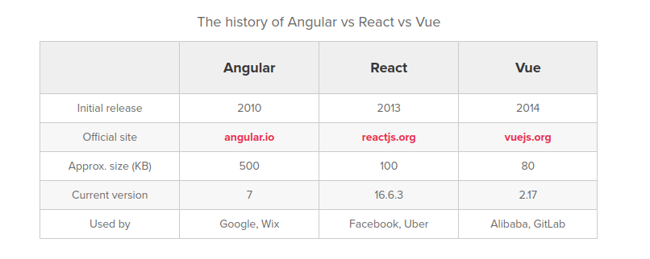
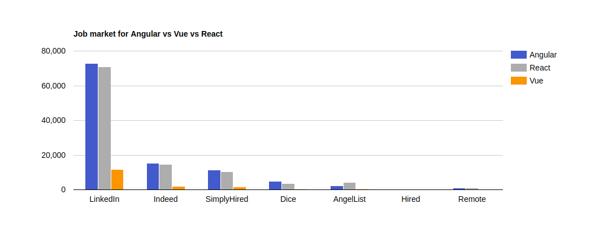

# Front-end API app 

## React, Angular or vue.js

### Angular
Angular is released in 2010, makes it the oldest. 
- It's a TypeScript(microsoft) based framework. 
- detailed documentation 
one-way data binding. minimized risks of possible errors 
- MVVM (Model-View-ViewModel) allows developers to work separately on same app section using same set data. 

con's 
- Variety of dirrerent structures makes it harder to learn. 
- Relatively slower performance
- Steep learning cure. Mastering Angular requires you to learn associated concepts like TypeScript and MVC 

Companies that use Angular: Microsoft, UPS, Udemy, Nike, Google, .. 

### Vue.js
Newest framework. Developed by ex-Google employee.
- Empowered HTML, Can help optimize HTML blocks handling with the use of different components
- Detailed documentation. You only need basic knowledge of HTML and JS. Very easy to learn. 
- Adaptability. Similar to Angular and React in terms of design and architecture 
- Good integration. Can be used for single-page apps and more difficult web interfaces. 

con's:
- lack of resources. Small market share. Because it's newer. 
- no experience with solutions if it comes to huge projects (new)

Companies that use Vue.js: Adobe, Gitlab, Codeship,.. 

### React 
developed by Facebook
React is an easy to learn framework, thanks to it's simple design, use of JSX for templating. Highly documentated. 
- less time worrying about framework-specific code
- Extremely fast
- Great support for server-side rendering. Powerful framework for content-focused apps

con's 
- The community is devided on the best way to write CSS in React, between tradional stylesheets and CSS-in-JS 
- It's moving away from class-based components, can be barrier for developers who are more comfortable with OOP

Companies that use Reat: Facebook, IG, Netflix, Whatsapp, Codeacademy, ... 

